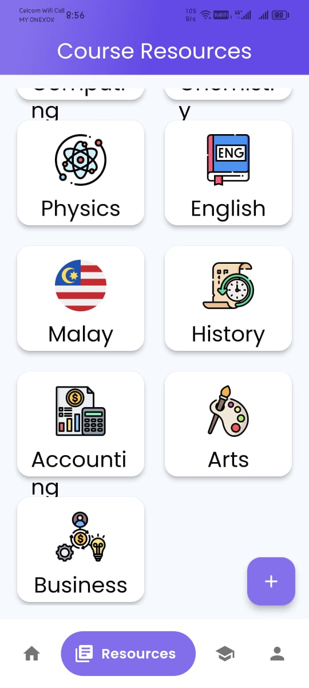
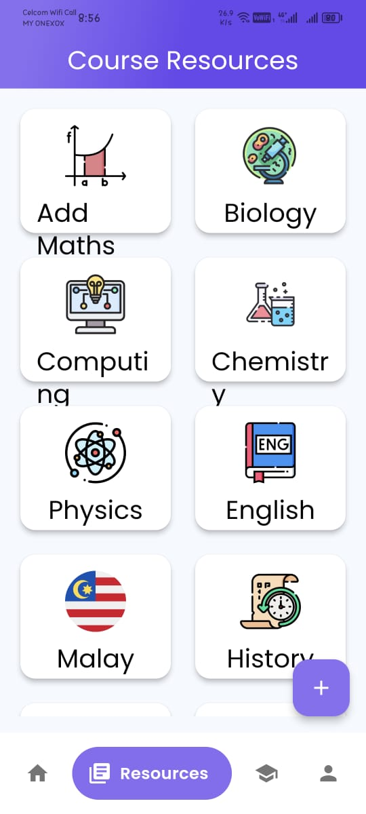
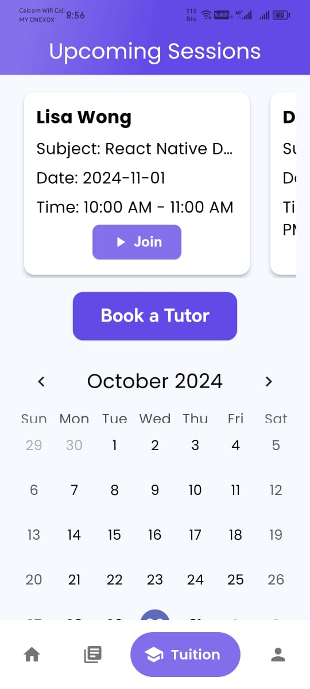

# EduConnect

## Bridging the Educational Gap in Malaysia

EduConnect aims to close the educational divide in Malaysia by offering accessible resources and personalized tutoring to students in underserved rural areas, with a focus on those in Sabah and Sarawak. Designed to support students who face limitations in digital resources and internet connectivity, EduConnect provides quality content, mentorship, and tutoring services to promote educational equity in remote regions. Our vision for EduConnect includes developing an integrated chat feature to facilitate real-time communication between students and mentors/tutors. This enhancement will foster stronger connections and provide immediate support, creating an interactive and supportive learning community.

## Key Features

1. **Offline Access to Learning Resources**
   - Access downloadable educational materials like past year papers, notes, and videos offline, helping students in remote areas with limited internet.

2. **Resource Sharing among Community**
   - Allows any contributors to share their study resources, supporting peer sharing and collaborative learning.

3. **Personalized Tutoring and Mentorship**
   - Book qualified tutors for one-on-one sessions tailored to individual needs, enhancing personalized guidance and support.

4. **Integrated Tutor and Resource Recommendations**
   - Receive personalized tutor and resource suggestions based on community preferences and ratings for a better learning experience.

## Project Setup

To set up the project locally, start by cloning the repository using:
```bash
git clone <repository-url>
cd project-directory
```
Once you’re in the project directory, install the necessary dependencies specified in the `pubspec.yaml` file by running:
```bash
flutter pub get
```
After the dependencies are installed, you can launch the application on an emulator or a connected device with:
```bash
flutter run
```
If you're preparing the app for distribution, you can build a release APK using:
```bash
flutter build apk --release
```
This command creates a production-ready APK file in the `build/app/outputs/flutter-apk/` directory.

### Screenshots








## Dependencies used
- 

## License
- MIT License
